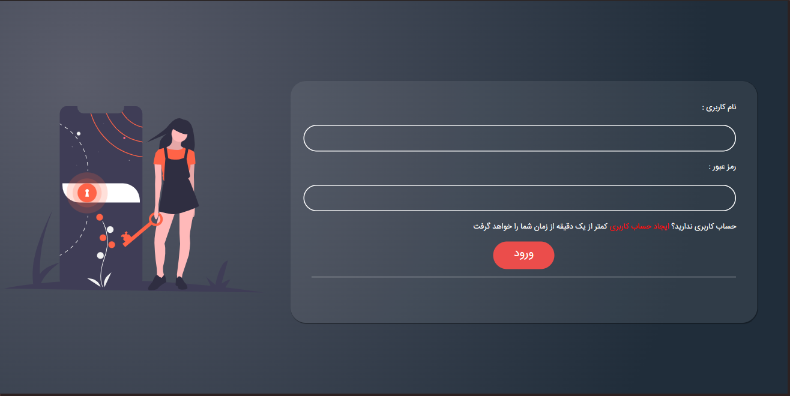
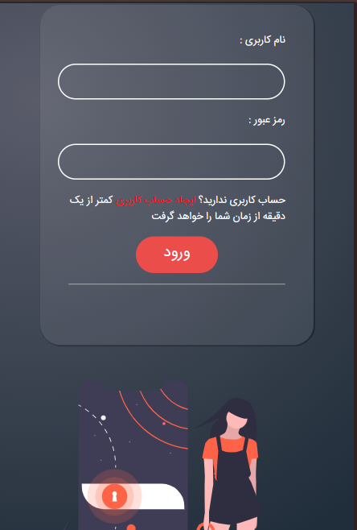

# Login Project

   

## Overview
The **Login Project** is a sample project built to showcase a secure and responsive login interface. This project is developed as a portfolio piece to demonstrate front-end and back-end integration, as well as user authentication principles.

## Table of Contents
- [Prerequisites](#prerequisites)
- [Installation](#installation)
- [Usage](#usage)
- [Screenshots](#screenshots)
- [Examples](#examples)
- [Documentation](#documentation)
- [Contributing](#contributing)
- [License](#license)
- [Contact](#contact)

## Prerequisites
To run this project locally, you need:
- **Node.js** (>=14.x)
- **npm** (>=6.x)
- Optional: **Git** for version control

## Installation
1. Clone the repository:
   ```bash
   git clone https://github.com/sajjad-sisakhtpour/login.git
   ```
2. Navigate to the project directory:
   ```bash
   cd login
   ```
3. Install dependencies:
   ```bash
   npm install
   ```

## Usage
After installation, run the project:
```bash
npm start
```
Navigate to `http://localhost:3000` in your browser to view the login interface.

## Screenshots
Below are screenshots of the project in action:
- **Login Screen**  
  
  
  

## Examples
### Login Request
```javascript
fetch('/api/login', {
  method: 'POST',
  headers: { 'Content-Type': 'application/json' },
  body: JSON.stringify({ username: 'example', password: 'password' })
})
  .then(response => response.json())
  .then(data => console.log(data));
```

## Documentation
For detailed documentation, visit the [Wiki](https://github.com/sajjad-sisakhtpour/login/wiki) or refer to the `docs/` directory.

## Contributing
Contributions are welcome! Please:
1. Fork the repository.
2. Create a new branch: `git checkout -b feature-branch`
3. Commit changes: `git commit -m 'Add feature'`
4. Push to the branch: `git push origin feature-branch`
5. Submit a pull request.

## License
This project is licensed under the MIT License - see the [LICENSE](LICENSE) file for details.

## Contact
**Sajjad Sisakhtpour**  
- **Email**: [sajjad.sisakhtpour@gmail.com](mailto:sajjad.sisakhtpour@gmail.com)
- **GitHub**: [sajjad-sisakhtpour](https://github.com/sajjad-sisakhtpour)
- **LinkedIn**: [sajad-sisakht-pour](https://ir.linkedin.com/in/sajad-sisakht-pour)

## Live Demo
Try the project live [here](https://sajjad-sisakhtpour.github.io/login) (replace with actual link).
